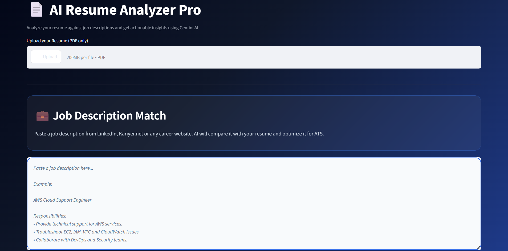
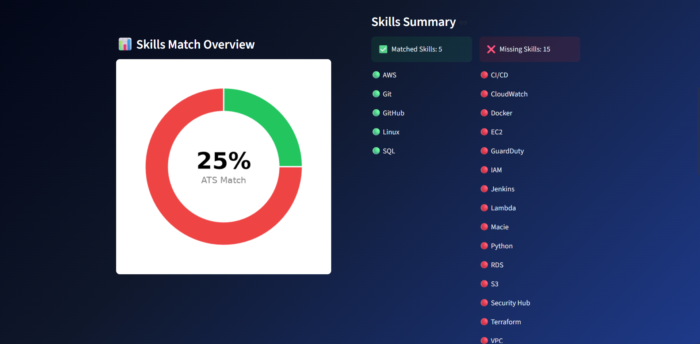
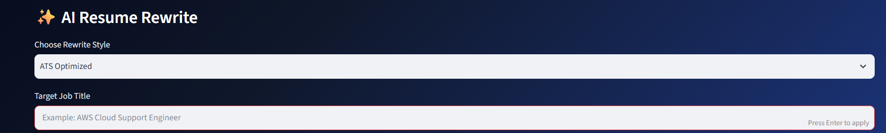

# 🤖 AI Resume Analyzer Pro

<p align="center">
  AI-powered ATS Resume Analyzer built with <b>Python, Streamlit & Google Gemini AI</b>.
</p>

<p align="center">
  Upload your resume, compare it with a job description, receive ATS feedback, rewrite your resume with AI, and download a professional PDF report.
</p>

---

## 📸 Application Preview

### 🏠 AI Resume Analyzer Dashboard

> Replace this image after uploading `dashboard.png` to the `screenshots` folder.



---

### 🎯 ATS Match Dashboard

| ATS Dashboard                  | Skills Match Overview                |
| ------------------------------ | ------------------------------------ |
|  |  |

The dashboard instantly compares your resume with a target job description and displays:

* 🎯 ATS Match Score
* ✅ Matched Skills
* ❌ Missing Skills
* 📈 ATS Progress Indicator

---

### 🤖 AI Resume Analysis



Gemini AI provides recruiter-style feedback including:

* Resume Summary
* Matched Skills
* Missing Skills
* ATS Improvement Suggestions
* Tailored Recommendations

---

### ✨ AI Resume Rewrite


Rewrite your resume specifically for the selected job role using ATS-friendly keywords and stronger bullet points.

---

## 🚀 Features

* 📄 Upload Resume (PDF).
* 💼 Compare Resume with any Job Description.
* 🎯 ATS Match Score Dashboard.
* 📊 Skills Match Overview (Donut Chart).
* 📉 Missing Skills Visualization.
* 🤖 AI Resume Analysis using Google Gemini.
* ✨ AI Resume Rewrite for a Target Role.
* 📥 Download AI Analysis Report as PDF.

---

## 🛠 Tech Stack

| Technology       | Purpose                     |
| ---------------- | --------------------------- |
| Python           | Backend Logic               |
| Streamlit        | Interactive Web Application |
| Google Gemini AI | Resume Analysis & Rewrite   |
| Matplotlib       | Charts & Visualizations     |
| ReportLab        | PDF Report Generation       |
| PyPDF            | Resume Text Extraction      |
| Python-dotenv    | API Key Management          |

---

## 📊 ATS Analysis Workflow

```text
Resume PDF
      │
      ▼
Extract Resume Text (PyPDF)
      │
      ▼
Compare Skills with Job Description
      │
      ├── ATS Match Score
      ├── Matched Skills
      ├── Missing Skills
      ▼
Google Gemini AI
      │
      ├── Resume Analysis
      ├── ATS Suggestions
      └── Resume Rewrite
      ▼
PDF Report Download
```

---

## ⚙️ Installation

```bash
git clone https://github.com/OmurErenTuran/ai-resume-analyzer-pro.git

cd ai-resume-analyzer-pro

pip install -r requirements.txt

streamlit run app.py
```

---

## 🔑 Environment Variables

Create a `.env` file inside the project folder.

```env
GEMINI_API_KEY=YOUR_GEMINI_API_KEY
```

---

## 📁 Project Structure

```text
ai-resume-analyzer-pro/
│
├── app.py                 # Main Streamlit Application
├── requirements.txt        # Python Dependencies
├── README.md               # Project Documentation
├── .gitignore              # Ignore Secrets & Virtual Environment
├── screenshots/            # README Images
│   ├── dashboard.png
│   ├── skills-overview.png
│   ├── analysis.png
│   └── rewrite.png
└── .env                    # Gemini API Key (Not Uploaded)
```

---

## 🌟 Future Improvements

* 🌐 Streamlit Cloud Live Demo.
* 📄 AI Cover Letter Generator.
* 📊 Resume Before vs After Comparison.
* 📈 Recruiter Score Dashboard.
* 🔍 Keyword Heatmap Visualization.

---

## 👨‍💻 Author

**Eren Turan**

Cloud & IT Support Portfolio Project built with Python, AWS concepts, and Google Gemini AI.
